# 🚀 Kubernetes Pod Lifecycle Lab


Laboratório prático de Kubernetes para estudar ciclo de vida de Pods e Containers, SIGTERM, SIGKILL, hooks postStart/preStop, Init Containers e troubleshooting.

## Objetivo do projeto

Este repositório foi criado como laboratório de estudo e portfólio técnico para consolidar fundamentos de operação em Kubernetes com foco em cenários reais de diagnóstico e confiabilidade.

Ao final da execução, você terá praticado:

- comportamento de Pods em diferentes fases;
- encerramento gracioso de aplicações;
- uso de hooks de ciclo de vida;
- troubleshooting de Init Containers e falhas de inicialização.

## Competências demonstradas

Este projeto evidencia competências práticas em:

1. Kubernetes
2. Docker
3. k3d
4. Linux
5. YAML
6. Troubleshooting
7. Observabilidade básica com logs e eventos
8. Boas práticas de documentação técnica
9. Organização de repositório GitHub
10. Automação com scripts shell
11. GitHub Actions

## Por que este projeto é relevante?

Entender o ciclo de vida dos Pods é essencial para construir aplicações resilientes em Kubernetes. Na prática, falhas de inicialização, encerramentos abruptos e problemas de configuração impactam diretamente disponibilidade, confiabilidade e experiência do usuário.

Ao dominar temas como `SIGTERM`, `preStop`, `Init Containers`, logs e eventos, você desenvolve capacidade de:

- reduzir indisponibilidade em deploys e reinicializações;
- investigar incidentes de forma mais rápida e estruturada;
- aplicar boas práticas operacionais que são esperadas em ambientes de produção.

## Tecnologias utilizadas

- Kubernetes
- kubectl
- k3d
- Docker
- Python
- Flask
- YAML
- GitHub Actions

## Validação automática de YAML

O projeto possui validação automática de arquivos `.yaml` e `.yml` via GitHub Actions no workflow:

- `.github/workflows/validate-yaml.yml`

A pipeline executa `yamllint` em `push` e `pull_request` para a branch `main`, ajudando a manter manifests e workflows consistentes.

Evidência da pipeline em sucesso:

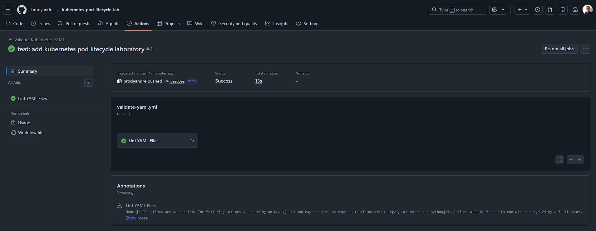

## Arquitetura do laboratório

```text
[WSL2/Linux + Terminal]
          |
          v
    scripts/*.sh
          |
          v
 [k3d cluster: meucluster]
          |
          +--> Namespace: pod-lifecycle-lab
                  |
                  +--> Pod nginx (ciclo básico)
                  +--> Deployment app (SIGTERM / graceful shutdown)
                  +--> Deployment app (postStart / preStop)
                  +--> Pod com Init Container (sucesso)
                  +--> Pod com Init Container (falha)
                  +--> Pod com Init Container (corrigido)
          |
          v
 Logs + Events + Describe --> Troubleshooting orientado a evidências
```

## Conteúdos estudados

- Ciclo de vida do Pod
- Ciclo de vida dos Containers
- SIGTERM
- SIGKILL
- postStart
- preStop
- Init Containers
- Troubleshooting

## Estrutura do projeto

```text
kubernetes-pod-lifecycle-lab/
├── app/
│   ├── app.py
│   ├── requirements.txt
│   └── Dockerfile
├── manifests/
│   ├── 00-namespace.yaml
│   ├── 01-basic-pod-lifecycle.yaml
│   ├── 02-sigterm-graceful-shutdown.yaml
│   ├── 03-poststart-prestop-hooks.yaml
│   ├── 04-init-container-success.yaml
│   ├── 05-init-container-failure.yaml
│   └── 06-init-container-fixed.yaml
├── scripts/
│   ├── setup.sh
│   ├── build-image.sh
│   ├── import-image-k3d.sh
│   ├── apply-all.sh
│   ├── check.sh
│   └── cleanup.sh
├── docs/
│   ├── conceitos.md
│   ├── comandos.md
│   ├── evidencias.md
│   ├── publicacao-github.md
│   └── troubleshooting.md
├── assets/
│   └── screenshots/
│       └── .gitkeep
├── .github/
│   └── workflows/
│       └── validate-yaml.yml
├── .gitignore
├── .yamllint
├── LICENSE
└── README.md
```

## Como executar o laboratório

### 1) Clonar repositório

```bash
git clone https://github.com/brodyandre/kubernetes-pod-lifecycle-lab.git
cd kubernetes-pod-lifecycle-lab
```

### 2) Criar cluster k3d

```bash
k3d cluster create meucluster --servers 3 --agents 3
```

```bash
k3d cluster list
kubectl get nodes
```

Evidências:

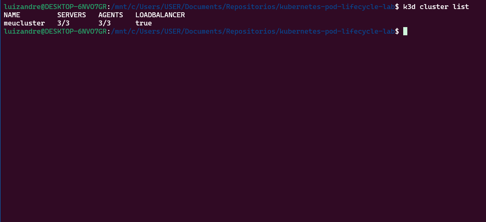
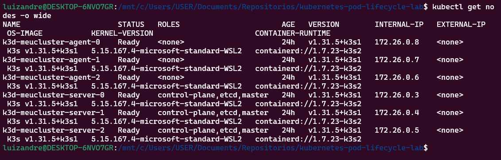

### 3) Validar ambiente

```bash
chmod +x scripts/*.sh
./scripts/setup.sh
```

### 4) Buildar imagem

```bash
./scripts/build-image.sh
```

Evidência:

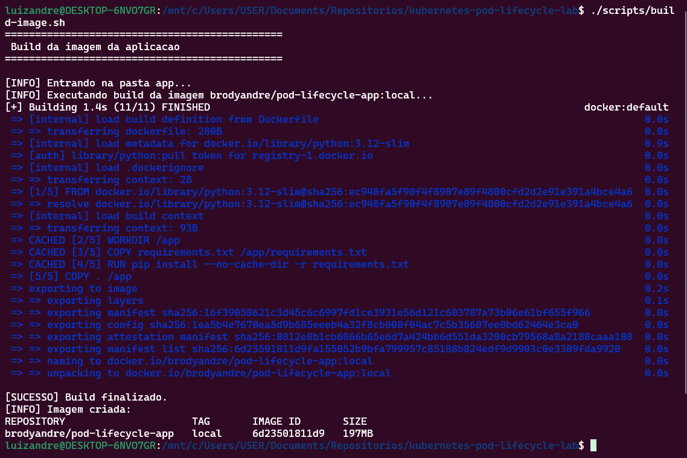

### 5) Importar imagem no k3d

```bash
./scripts/import-image-k3d.sh
```

Evidência:

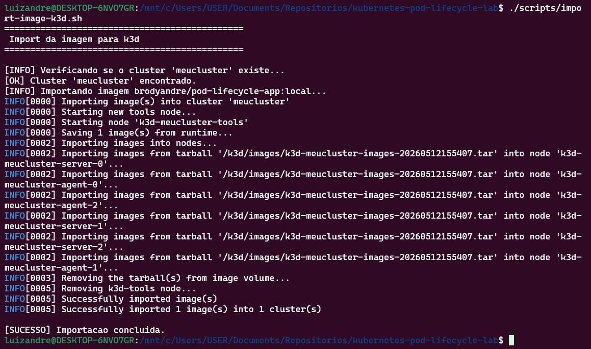

### 6) Aplicar manifests

```bash
./scripts/apply-all.sh
```

### 7) Verificar pods

```bash
kubectl get pods -n pod-lifecycle-lab
```

Evidência:

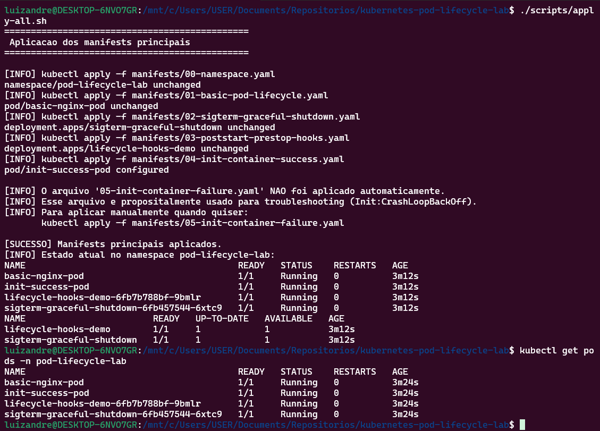

### 7.1) Verificar Init Container com sucesso

```bash
kubectl describe pod -n pod-lifecycle-lab init-success-pod
```

Evidência:

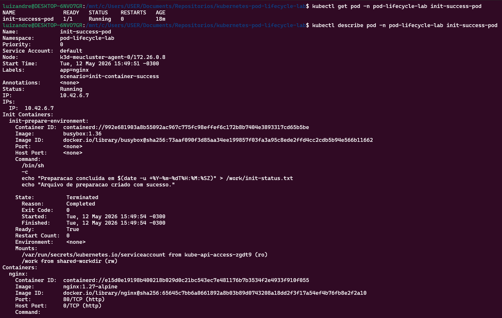

### 8) Testar graceful shutdown

```bash
kubectl logs -n pod-lifecycle-lab -l app=pod-lifecycle-app -f
kubectl delete pod -n pod-lifecycle-lab -l app=pod-lifecycle-app
```

```bash
kubectl get events -n pod-lifecycle-lab --sort-by=.lastTimestamp
```

Evidências:

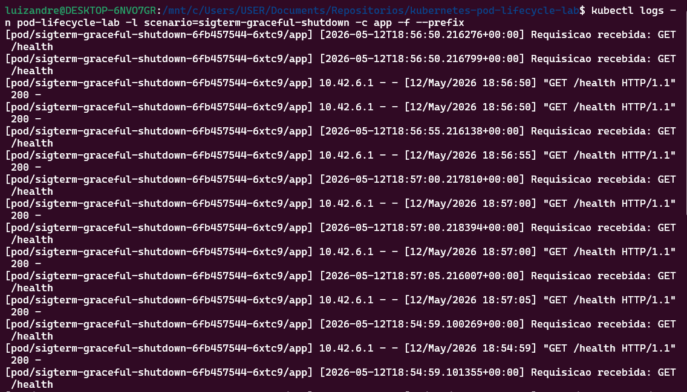
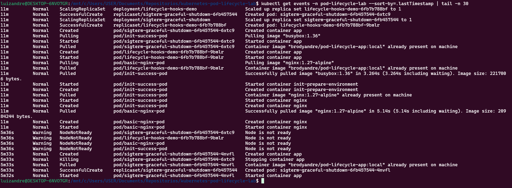

Observação: o print de logs registra o tráfego e healthchecks contínuos durante o teste. A evidência explícita de término do Pod está no print de eventos.

### 8.1) Verificar hooks postStart e preStop

```bash
POD_HOOK=$(kubectl get pod -n pod-lifecycle-lab -l scenario=poststart-prestop-hooks -o jsonpath='{.items[0].metadata.name}')
kubectl exec -n pod-lifecycle-lab "$POD_HOOK" -- cat /tmp/poststart.log
kubectl delete pod -n pod-lifecycle-lab "$POD_HOOK"
kubectl get events -n pod-lifecycle-lab --sort-by=.lastTimestamp
```

Evidências:

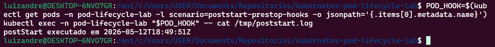
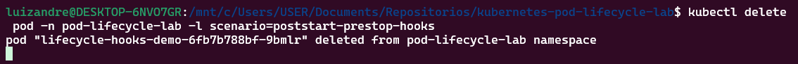

### 9) Testar initContainer com falha

```bash
kubectl apply -f manifests/05-init-container-failure.yaml
kubectl get pods -n pod-lifecycle-lab
kubectl describe pod -n pod-lifecycle-lab init-failure-pod
```

Evidência:

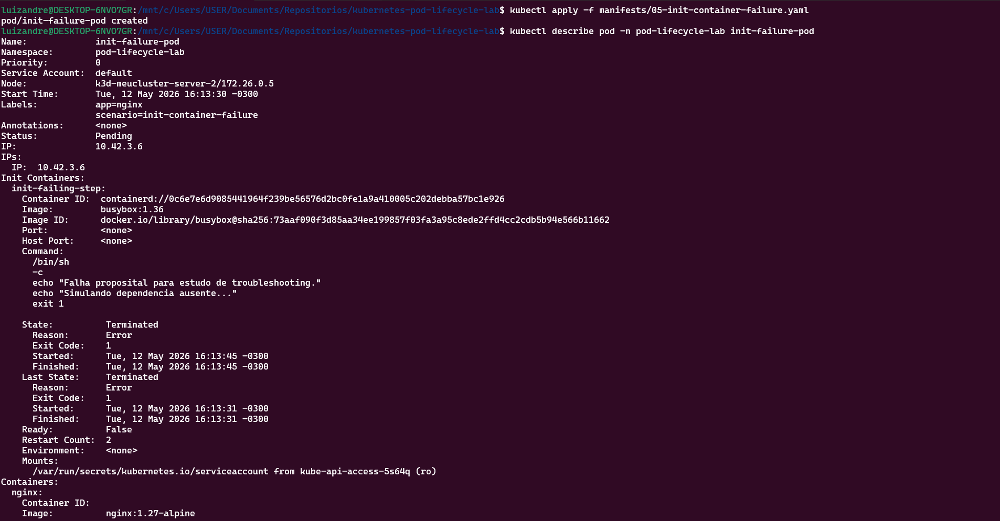

### 10) Corrigir initContainer

```bash
kubectl apply -f manifests/06-init-container-fixed.yaml
kubectl get pods -n pod-lifecycle-lab
```

Evidência:

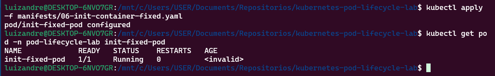

### 11) Limpar ambiente

```bash
./scripts/cleanup.sh
```

## Evidências sugeridas

Salve capturas de tela em `assets/screenshots/` para reforçar o valor de portfólio do projeto e facilitar avaliação técnica por recrutadores.

Checklist detalhado de captura:

- `docs/evidencias.md`

## Aprendizados principais

- Entendimento prático das fases de Pods e estados de Containers.
- Diferença operacional entre `SIGTERM` e `SIGKILL`.
- Uso de `postStart` e `preStop` para controlar início e encerramento.
- Aplicação de Init Containers para preparar e validar ambiente.
- Diagnóstico com `kubectl get`, `describe`, `logs` e `events`.

## Próximos passos

- Adicionar cenários com probes mais avançadas (`readiness`/`liveness`).
- Incluir validação de manifests com ferramentas como `kubeconform`.
- Publicar evidências visuais no README com imagens da pasta `assets/screenshots`.
- Evoluir para empacotamento com Helm Chart.

## Autor

Luiz André de Souza  
GitHub: https://github.com/brodyandre
